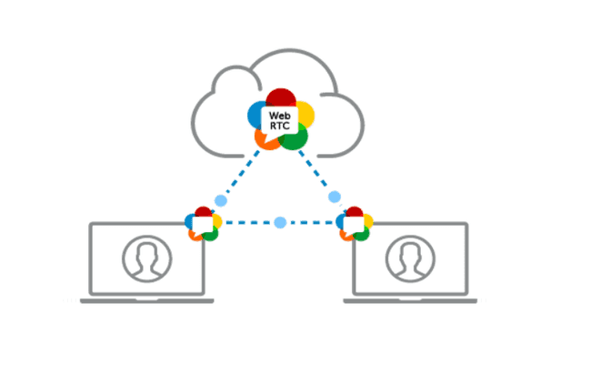
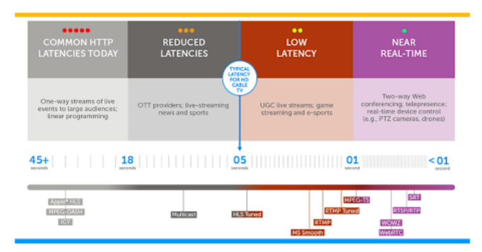
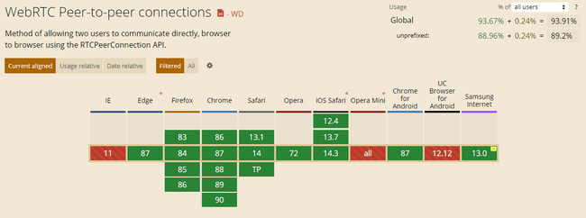
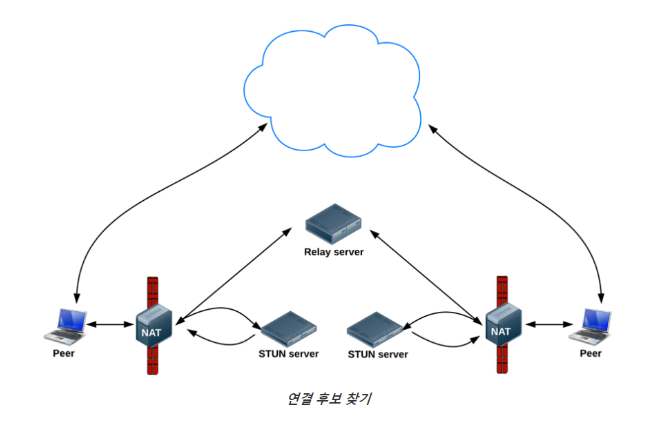
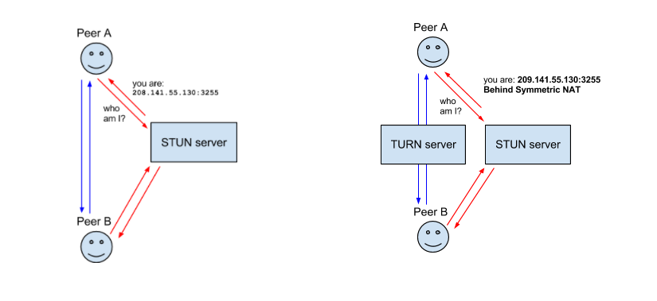
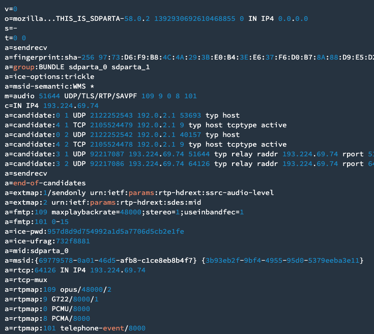
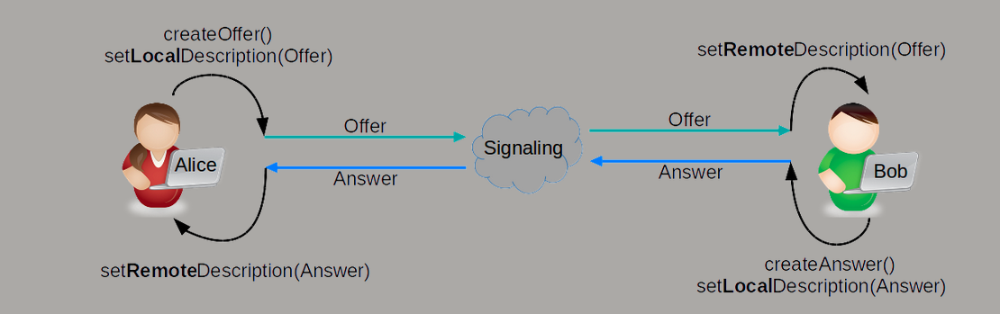

# WebRTC

> WebRTC ( Web Real-Time Communication )은 웹 애플리케이션과 사이트가 중간자 없이 브라우저 간에 오디오나 영상 미디어를 포착하고 마음대로 스트림 할 뿐 아니라, 임의의 데이터도 교환할 수 있도록 하는 기술
> 

- 즉, 드라이버나 플러그인 설치 없이 웹 브라우저 간 P2P 연결을 통해 데이터 교환을 가능하게 하는 기술
- 기존의 웹 2.0에서, 서버와 같은 중간자를 거치지 않고 브라우저 간을 P2P로 연결하는 기술 → 화상 통화, 실시간 스트리밍, 파일 공유, 스크린 공유 등이 WebRTC를 기반으로 하고 있음
- P2P 연결은 중개 서버를 거치지 않기 때문에 빠른 속도가 보장되며, HTTPS가 강제되기 때문에 보안이 보장 된다.

## 장점

1. Latency가 짧다.

1. 다른 드라이버가 필요 없이 커뮤니케이션이 가능하다. 
2. 개발하는 데 있어 진입장벽이 낮고, 무료로 가능하다. 

# 브라우저 호환성

- 특히, 크롬에서 호환성이 좋다.
- 하지만 아직까지는 다양한 플랫폼에서 표준화가 완전히 구현되지 않았음 → adapter.js 라이브러리를 함께 사용하여, 크로스 브라우징 이슈를 해결해야 함

# P2P 절차

- P2P 방식의 커뮤니케이션이기 떄문에 각각의 웹 브라우저는 다음과 같은 절차를 밟아야 한다.

1. 각 브라우저가 P2P 커뮤니케이션에 동의
2. 서로의 주소를 공유
3. 보안 사항 및 방화벽 우회
4. 멀티미디어 데이터를 실시간으로 교환

- 브라우저는 웹 서버가 아니기 때문에, 외부에서 접근할 수 있는 주소가 없기 때문이다. WebRTC가 P2P 기반이긴 하지만 통신 설정 초기 단계에서는 중재자의 역할이 필요하다.

# 방화벽과 NAT( Network Address Translation ) 트래버셜

- 일반적인 컴퓨터에는 공인 IP가 할당되어 있지 않다. 그 원인으로는 방화벽, 여러 대의 컴퓨터가 하나의 공인 IP를 공유하는 NAT, 유휴 상태의 IP를 일시적으로 임대받는 **DHCP** 때문이다.
- 즉, 공인 IP뿐만 아니라 해당 네트워크에 연결된 **사설 IP 주소**까지 알아내야 특정한 사용자를 지정할 수 있다.
- 일반적으로는 **라우터**가 NAT 역할을 수행 → 외부에서 접근하는 공인 IP와 포트 번호를 확인하여 현재 네트워크 내의 사설 IP들을 적절하게 매핑시켜준다.
- 하지만 어떤 라우터들은 특정 주소나 포트와의 연결을 차단하는 방화벽 설정이 되어있다.  → 라우터를 통과해서 연결할 방법을 찾는 과정을 **NAT 트래버셜**이라고 한다.

<aside>
💡 NAT는 네트워크 주소 변환으로 IP패킷의 TCP/UDP 포트 숫자와 소스 및 목적지 IP 주소 등을 재기록하면서 트래픽을 주고 받는 기술이다.

</aside>

## STUN & TURN

### 1) STUN ( Session Traversal Utillities for NAT )

- stun 방식은 단말이 자신의 공인 IP 주소 포트를 확인하는 과정에 대한 프로토콜이다.
- stun 서버는 인터넷의 복잡한 주소들 속에서 유일하게 자기 자신을 식별할 수 있는 정보를 반환해준다.
- stun 서버에 요청을 보내면 stun 서버는 NAT 뒤에 있는 피어들이 서로 연결할 수 있는 공인 IP주소와 포트 번호를 찾아준다.

### 2) TURN

- STUN 서버를 사용하더라도 라우터의 방화벽 정책이나 이전에 연결된 적이 있는 네트워크만 연결 할 수 있게 제한이 거렬있는 경우에 의해 STUN 서버를 통해 자기 자신의 주소를 찾아내지 못한 경우 TURN 서버를 대안으로 사용하게 된다.
- 네트워크 미디어를 중개하는 서버를 이용하는 것 → 중간에 서버를 한번 거치기 때문에 엄밀히 P2P 통신이 아니게
    
    되며 그 구조상 지연이 필연적으로 발생하여 TURN은 최후의 수단으로 선택된다. 
    

## Candidate와 ICE

- STUN과 TURN 서버를 이용해 흭득했던 IP주소와 프로토콜, 포트의 조합으로 구성된 연결 가능한 네트워크 정보들을 Candidate라고 한다.
- 후보를 수집하면 일반적으로 3개의 주소를 얻게 된다.
    - 자신의 사설 IP와 포트 넘버
    - 자신의 공인 IP와 포트 넘버
    - TURN 서버의 IP와 포트 넘버
- 이 모든 과정을 ICE라는 프레임워크에서 이루어진다. P2P 연결을 가능하게 최적의 경로를 찾아주는 프레임워크이다.

## SDP ( Session Description Protocol )

- 스트리밍 미디어의 해상도나 형식, 코덱 등의 멀티미디어 컨텐츠의 초기 세팅정보를 설정하기 위해 채택한 프로토콜
- 발행구독모델과 유사한 제안 응답 모델을 가지고 있다.
    - 어떤 피어가 이러한 미디어 스트림을 교환할 것이라고 제안을 하면 상대방으로부터 응답이 오기를 기다린다는 의미이다.
    - 그렇게 응답을 받으면 각자의 피어가 수집한 ICE 후보중에 최적의 경로가 있는 ICE 후보를 선택
    - 그 후 피어가 로컬 데이터 스트림의 엔드포인트가 생성되며 이 데이터는 양방향 통신 기술을 통해 전송된다.

## 시그널링

- 웹이나 앱 어플리케이션간에 스트리밍 데이터를 교환하기 위해 서로 다른 네트워크에 있는 2개의 디바이스 혹은 웹 브라우저들을 통신하기 위해서는 ICE 교환과 SDP 교환이 필요하다.
- 이러한 과정이 ‘시그널링’이라 부르고, 각 디바이스들을 상호간에 동의된 서버 ( [Socket.io](http://Socket.io) or WebSocket )에 연결시키고 이 떄 상호간에 동의된 서버를 시그널링 서버라고 한다.

# SDP 교환 및 ICE 교환 과정 예시

1. 앨리스는 offer를 생성한다. 
2. offer를 LocalDescription에 등록한다. 
3. 생성한 offer를 밥에게 보낸다. 
4. 밥은 받은 offer를 RemoteDescription에 등록한다. 
5. 밥은 answer를 생성한고 앨리스에게 보낸다.
6. 앨리스는 밥에게 받은 answer를 RemoteDescription에 등록한다. 
7. 앨리스와 밥은 시그널링 서버를 통해 각자의 ICE Candidates를 전송한다. 
8. 그리고 각자 수신받은 ICE Candidate를 addIceCandidate 함수를 호출하여 상대방의 ICE Candidate를 네트워크 정보에 추가한다. 

### 📘 참조

- [https://wormwlrm.github.io/2021/01/24/Introducing-WebRTC.html](https://wormwlrm.github.io/2021/01/24/Introducing-WebRTC.html)
- [https://gh402.tistory.com/38](https://gh402.tistory.com/38)
- [https://aal-izz-well.tistory.com/entry/WEBRTC-공부한-것-정리](https://aal-izz-well.tistory.com/entry/WEBRTC-%EA%B3%B5%EB%B6%80%ED%95%9C-%EA%B2%83-%EC%A0%95%EB%A6%AC)
- [https://m.post.naver.com/viewer/postView.naver?volumeNo=30734315&memberNo=33264526](https://m.post.naver.com/viewer/postView.naver?volumeNo=30734315&memberNo=33264526)
- [https://tech.kakaoenterprise.com/121](https://tech.kakaoenterprise.com/121)
- [https://webrtc.org/getting-started/media-devices](https://webrtc.org/getting-started/media-devices)
